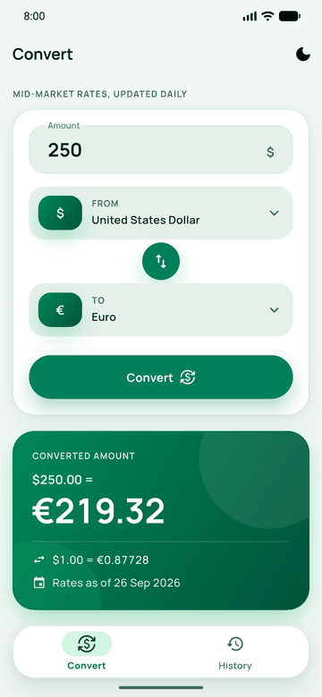
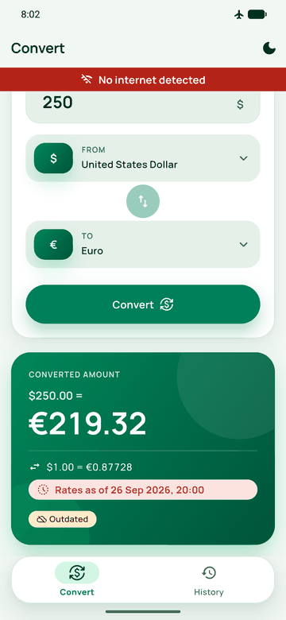
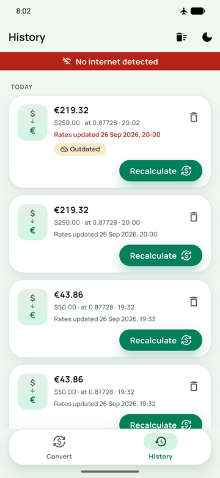
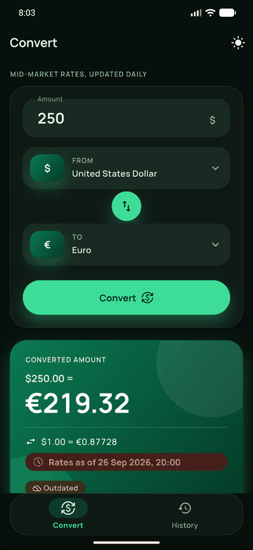
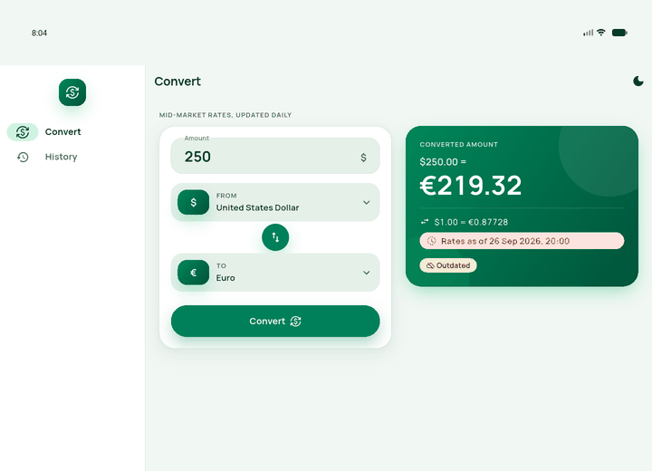

# EFG Currency Converter

A Flutter currency converter built for the EFG Holding mid-level Flutter assessment. It fetches exchange rates from the [Frankfurter API](https://frankfurter.dev), converts amounts through a validated form, and saves every conversion on the device, so history survives restarts. When the network is unavailable, it converts with the last rates it saved and marks those results as outdated.

| Converter | Offline, outdated rates | History | Dark mode |
|---|---|---|---|
|  |  |  |  |



## Setup

Tested with Flutter 3.44.4 (stable channel) and Dart 3.12.2. No API key is needed, because Frankfurter is a free public API.

```bash
git clone https://github.com/BakriIWNL/EFG_task.git
cd EFG_task
flutter pub get
flutter run
```

The generated files (`*.g.dart` models and the localization classes) are committed, so a clean clone builds without code generation. To regenerate them after changing a model or a string:

```bash
dart run build_runner build --delete-conflicting-outputs
flutter gen-l10n
```

Run the static checks and tests with:

```bash
flutter analyze
flutter test
```

The API base URL is a compile-time variable, so the app can point at a self-hosted Frankfurter instance without code changes:

```bash
flutter run --dart-define=API_BASE_URL=https://your-frankfurter-host
```

`android/gradle.properties` sets `kotlin.incremental=false`. On Windows, when the pub cache and the project are on different drives, incremental Kotlin compilation of plugins fails with a "different roots" error; this setting avoids it.

## Features

- **Converter:** enter an amount, pick the source and target currencies from a searchable list, and convert. Currencies are shown by their symbol (`$`, `€`, `£`) with the full name next to it. When the API has no symbol for a currency, its code is shown instead. The amount field accepts positive numbers with up to two decimal places, and a comma is read as a decimal point. Picking the same currency on both sides swaps the pair.
- **Offline mode:** when the device has no connection, a red "No internet detected" strip slides in under the app bar on both tabs. The currency lists then offer only pairs whose rates are saved on the device, and swapping is disabled when the reverse pair is not saved.
- **Outdated results:** if the rates request fails, the conversion uses the saved rates. The "Rates as of" line turns red and shows the date and time (hours and minutes) of the last successful update, and the result gets an "Outdated" tag. If the request fails and nothing is saved, the app shows "Something went wrong. Please try again later."
- **History:** every conversion is saved and listed newest first, grouped by day.
  - Each entry shows when its rates were last updated. Entries converted with saved rates carry an "Outdated" tag and a red update time.
  - Every entry has a Recalculate button that calls the rates endpoint again. On success it updates the result and removes the tag. On failure it recalculates with the saved rates, keeps the tag and updates the "last updated" time.
  - Entries can be deleted by swiping or with the delete button, with an undo action. The whole history can be cleared after confirmation.
- **Shared convert button:** Convert and Recalculate are the same `ConvertButton` widget.
- **Dark mode:** follows the system by default. The app bar toggle overrides it, and the choice is saved.
- **Phone and tablet layouts:** see [Responsive layout](#design-system).

## Architecture

The project mirrors the structure and conventions of an existing production Flutter codebase (Finzey) that I work with, so it reads like a team codebase rather than a one-off. Each feature has a `data` layer and a `presentation` layer. There is no domain layer and there are no use cases: cubits call repositories directly.

| Layer | Contents |
|---|---|
| `data/models` | `json_serializable` models that extend `Equatable` |
| `data/repositories/remote`, `data/repositories/local` | Abstract repositories: the contracts the cubits depend on |
| `data/datasources/remote`, `data/datasources/local` | Implementations: `XDatasource extends XRepository` and `LocalXDataSource extends LocalXRepository` |
| `presentation/controllers` | Cubits, each with its state in a `part` file |
| `presentation/screens`, `presentation/widgets` | A screen plus its public `BuildX` widgets, attached to the screen as `part` files |

| Path | Responsibility |
|---|---|
| `lib/main.dart`, `lib/app.dart` | Entry point and `MyApp` (app-wide cubits, theme, localization, router) |
| `lib/service_locator.dart` | Root `ServiceLocator`; each feature registers itself in its own `XServiceLocator` |
| `lib/config/routes` | `AppRoutes`, `AppRouter` and page transitions |
| `lib/config/themes` | Color schemes, light and dark flavors, `AppThemeData`, `AppTextStyles`, `AppThemeBuilder` and the design tokens |
| `lib/config/localizations` | ARB strings and the generated `AppLocalizations` |
| `lib/core/api` | `DioConsumer` contract, `ApiConsumer` implementation, error and response handlers, retry interceptor |
| `lib/core/services` | Generic CRUD client and the `CachingDataFactory` / `SimpleCachingService` cache |
| `lib/core/controllers` | `NetworkCubit` (connectivity) and `ThemeController` |
| `lib/core/components` | The shared `Custom*` widget library, alerts and snack bars |
| `lib/core/utils` | Enums, cache keys, extensions, validation helpers and input formatters |
| `lib/shared/widgets` | Widgets used by more than one feature (`ConvertButton`) |
| `lib/features/home` | Navigation shell (`NavBarCubit`, floating bottom bar or navigation rail) |
| `lib/features/converter` | Currencies, rates, conversion |
| `lib/features/history` | Saved conversions and recalculation |

Key decisions:

- **State management:** Cubits with `Equatable` states, a hand-written `copyWith`, and a `GenericStates` value (`initial`, `loading`, `success`, `error`) for each async operation, so one screen can show several independent loading states.
- **Dependency injection:** GetIt through per-feature `XServiceLocator` mixins. Cubits receive their repositories through the constructor, and the router creates them with `BlocProvider`, so tests can pass mocks directly.
- **Caching is a cubit decision:** repositories never fall back to the cache on their own. The cubit calls the remote repository and then decides what to do:
  - on success, it saves the data with `cacheCurrencies` / `cacheRates` on the local repository;
  - on failure, it reads the saved data with `getCachedCurrencies` / `getCachedRates`.

  The cache is `SharedPreferences`, reached through `CachingDataFactory(CachingType.simple).cacheService`.
- **Rates:** one request fetches every rate for the selected base currency (`/v2/rates?base=`). Rates are saved per base, together with the time they were fetched. That time is the "last updated" time shown on outdated results and history entries.
- **Connectivity:** `NetworkCubit` listens to `connectivity_plus`. The converter screen forwards its state to `ConverterCubit.changeConnectivity`, which switches the currency lists to the saved pairs.
- **Error handling:** `ApiConsumer` catches `DioException`s and returns `Left(NetworkFailure)`, and a retry interceptor retries transient failures. The UI shows a localized message instead of raw failure text.
- **History refresh:** history reloads whenever the History tab is selected, so conversions made on the Converter tab appear there.
- **Strings:** every user-facing string is in `app_en.arb` and is read through `context.localizations`.
- **Code style:** the reference project's strict lint set, package imports, public widget classes and no comments, with `trailing_commas: preserve` so the formatter keeps the multi-line layout.

Trade-offs and what I would revisit with more time:

- **No domain layer.** This follows the reference architecture and keeps the file count proportional to the app. The cost is that business rules live in the cubits and models: which cache to fall back to, and the conversion maths in `Conversion.fromRates` / `recalculate`. In a larger app I would move those into use cases.
- **History is one JSON list in `SharedPreferences`.** This is simple and has no extra dependencies, and it is fine for hundreds of entries. For large histories, paging or search, I would move it to a database such as Drift.
- **Offline conversion only works for base currencies fetched before.** Each base needs one successful request before it can be used offline, and only the latest rates per base are kept.
- **Rates are published once per working day.** Frankfurter publishes ECB reference rates, so "live" means the latest published rates. The "Rates as of" line shows their date.
- **`connectivity_plus` reports network interfaces, not real internet access.** The cached-rate fallback is triggered by the failed request, not by the connectivity state, so a captive portal still ends up on saved rates. Only the red strip depends on connectivity.
- **English only.** Adding a language is a new ARB file, because every string is already localized.

## Design system

- **Palette:** emerald green is the primary color: `#00805A` in light mode and mint `#3DDC97` in dark mode.
  - Hero surfaces (the result card, the brand mark and the selected-currency badges) use a `jungle` → `forest` gradient with an `emerald` glow.
  - Neutrals are green-tinted. Amber marks outdated data, and red marks errors and the offline strip.
  - Contrast was checked against WCAG AA: white on the primary color is 4.96:1, and primary-colored text on the background is 4.56:1.
  - Each flavor defines its colors in a `LightColorScheme` or `DarkColorScheme`. Widgets read them through `context.colorScheme` or `context.appTheme`.
- **Tokens** (`lib/config/themes/tokens`) are static-const mixins that widgets use instead of literal numbers:
  - `AppSpacing`: 2, 4, 8, 12, 16, 20, 24, 32, 48;
  - `AppRadius`: 12, 16, 20, 28, 36 and pill;
  - `AppShadows`: `soft`, `raised` and a colored `glow`;
  - `AppDurations`: `fast`, `medium`, `slow`, `entrance`, `countUp`, `stagger`.
- **Typography:** Manrope, bundled as a variable font so it works offline. `AppTextStyles` has a mobile and a tablet scale and is read through `context.appTextStyles`. Every amount and rate uses tabular figures, so digits line up.
- **Themes:** `AppThemeFlavor` builds the light and dark themes from one function, so both modes share the same component styling. `ThemeController` stores the chosen flavor.
- **Component library** (`lib/core/components`):
  - containers and lists: `CustomCard`, `CustomListTile` (also the history list item, in its elevated variant);
  - inputs and actions: `CustomButton` (filled, outlined, text), `CustomTextField`, `CustomDropDown` (a bottom sheet on phones and a dialog on tablets, with search), `CustomThemeButton`;
  - labels: `CustomBadge`, `CustomTag`, `CustomSectionLabel`;
  - states: `CustomEmptyComponent`, `SomethingWentWrong`, `CustomProgressIndicator`, `ConnectivityBuilder`, `NoNetworkComponent`;
  - feedback: `CustomSnackBar`, `UiAlerts`.
- **Motion:**
  - entrances: screen bodies fade in, cards and the first screen of history entries rise in with a stagger (entries scrolled into view later appear immediately, so fast scrolling stays smooth), and icons, tags and empty states zoom in (`animate_do`); the error card shakes;
  - loading: skeleton placeholders on both screens (`skeletonizer`);
  - feedback: the converted amount counts up, the swap button rotates, and buttons scale down slightly while pressed;
  - transitions: the offline strip slides in and out, tabs cross-fade, and the theme icon rotates.
- **Responsive layout:**
  - phones (width ≤ 600) use a floating bottom navigation bar and a bottom-sheet currency picker;
  - wider screens use a navigation rail and a dialog picker, with the currency pair in one row;
  - above 950 the rail is extended and the form and result sit side by side;
  - content is width-capped, so it never stretches edge to edge.

Manrope is licensed under the SIL Open Font License; the license ships in `assets/fonts/OFL.txt`.

## Tests

`flutter test` runs 47 tests:

- **Cubits** (`bloc_test` + `mocktail`):
  - converter: currency loading with cache fallback, online and offline conversion, outdated results, offline currency filtering, swap rules;
  - history: loading; recalculation online, from saved rates, and with nothing saved; delete; restoring the list when clearing fails.
- **Local data sources:** caching and reading currencies, rates per base and history, against an in-memory `SharedPreferences`.
- **Models and validation:** `ExchangeRates` mapping, the symbol fallback, and amount validation rules.
- **Widgets:**
  - the offline strip appears and disappears with connectivity, in the theme's red;
  - "Rates as of" turns red and shows the time when outdated;
  - the history tile uses the shared list tile and `ConvertButton`, shows the tag only when outdated, and drops it after a successful recalculation;
  - swiping a history entry deletes it, and Undo brings it back;
  - history entries play their entrance animation only on first load, not again while scrolling.

## AI usage

The project was initialized from a script that generated the Flutter scaffold and the starting structure. I used **Claude Code** (Anthropic, Claude Opus 5.5) in VS Code to build the functionality on top of that base:
**Stitch.AI** (For design and conceptualization)

- the Frankfurter API client, caching and history storage;
- the converter and history features, including offline mode, outdated-rate handling and recalculation;
- refactoring the codebase to mirror the conventions of the production architecture I work with;
- the design system, tokens and animations;
- the tests and this README.

I set the requirements and made the architectural calls. When the reference architecture and the assessment brief conflicted, Claude Code asked and I decided. Examples: keeping caching as a cubit responsibility.